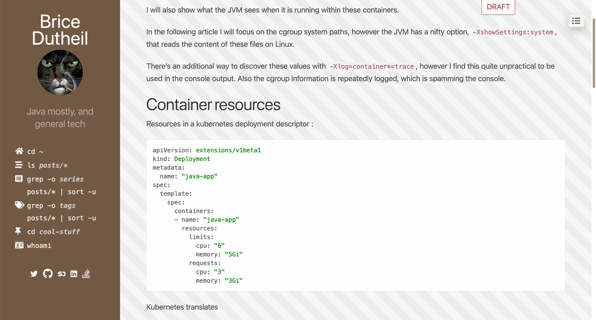
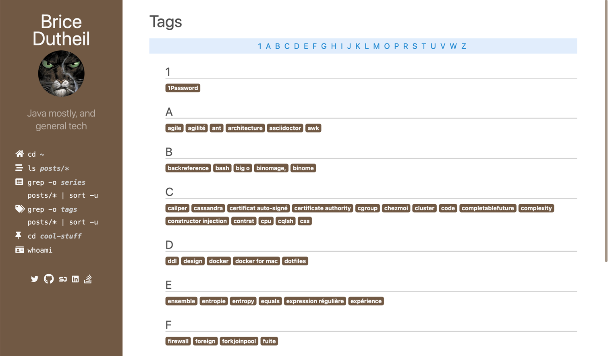
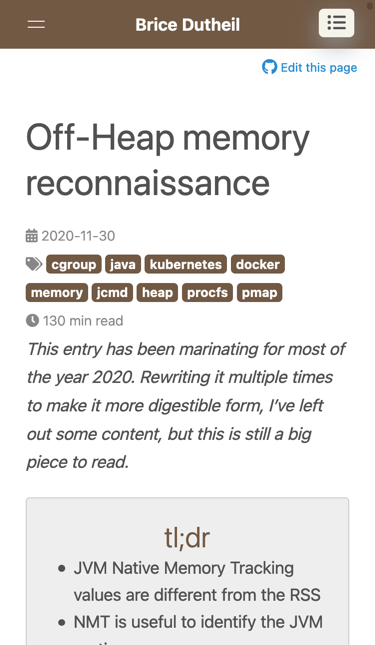

= ascii-press

image:https://img.shields.io/badge/License-MIT-blue.svg?style=flat[MIT license,link=https://github.com/bric3/ascii-press/blob/master/LICENSE.md]

//image:https://img.shields.io/github/release/bric3/ascii-press.svg[GitHub release]
//image:https://img.shields.io/github/stars/bric3/ascii-press.svg[GitHub stars]
//image:https://img.shields.io/github/forks/bric3/ascii-press.svg[GitHub forks]
//image:https://img.shields.io/github/issues/bric3/ascii-press.svg[GitHub issues]
//image:https://img.shields.io/github/issues-closed/bric3/ascii-press.svg[GitHub issues closed]

**ascii-press** is a https://gohugo.io[Hugo]'s theme derived from https://github.com/bric3[@bric3]'s' https://github.com/bric3/hyde-hyde[hyde-hyde]
  which was derived from https://github.com/spf13[@spf13]'s https://github.com/spf13/hyde.git[Hyde] and https://npf.io[Nate Finch's blog].

== Changes from hyde-hyde

The last commit from hyde-hyde is https://github.com/bric3/ascii-press/commit/14b387e6663c91750f0d80cc4cb17659d5979758[14b387e6663c91750f0d80cc4cb17659d5979758]

.Ascii-press features
* Draft section, it is not show in the menu, however it is available when pointing to `/drafts`
* Dark theme, activated automatically depending on system settings
* Thorough asciidoctor support
** Almost all elements are styled accordingly, and responsively
** Diagrams support, although it requires configuration on the site itself
** Archetypes
** Block switch, to have tabbed elements (code blocks, example blocks, etc)
** stem/asciimath support
** Font-Awesome 5 integration (asciidoctor outputs font-awesome compatible code, see https://github.com/asciidoctor/asciidoctor/issues/539[asciidoctor/asciidoctor#539] https://github.com/FortAwesome/Font-Awesome/issues/16477[FortAwesome/Font-Awesome#16477])
* Some additional shortcodes
* Social icons
** Additional icons like Speakerdeck
** Work around removal by ad-blockers of some icons like Twitter, Youtube, LinkedIn in the sidebar
* Responsive Table of Content, toggleable
* Tweak reading-time
* Taxonomy
** _Tags_ are arranged by letters
** Article _series_
** Tweaked responsive styling (eg. phones in landscape mode)
* Custom 404 page
* Custom landing page
* Github edit button on blog post

.Code changes
* Some stuff removed
** Old assets (`poole.css`, `hyde.css`)
** Generated CSSs as the site is not demoed on https://themes.gohugo.io[Hugo theme site]

.Hyde-hyde features
* Responsive (Mobile phone support)
* Portfolio section
* System font, instead of web fonts for privacy
* Gravatar
* Comment system (Disqus, Utterances, Commento, ...)
* https://github.com/bric3/ascii-press/blob/master/CHANGELOG-hyde-hyde.md[Hyde-hyde's specific changelog]

.Todos
* [ ] Revamp portfolio section
* [ ] Tocbot is not supported (in `.Site.Params.toc`)

// Investigate in link:layouts/partials/page-single/footer.html[layouts/partials/page-single/footer.html] with options as described in https://tscanlin.github.io/tocbot/#api[its documentation]

My https://blog.arkey.fr[blog] shows a real usage of this theme.

== Usage

=== Installation

*`Ascii-press`* can be easily installed as many other Hugo themes:

[source,sh]
----
$ cd HUGO_PROJECT

# then either clone ascii-press
$ git clone https://github.com/bric3/ascii-press.git themes/ascii-press

# or just add ascii-press as a submodule
$ git submodule add https://github.com/bric3/ascii-press.git themes/ascii-press

----

After that, choose `ascii-press` as the main theme.

* `config.toml`
[source,toml]
----
theme = "ascii-press"
----

* `config.yaml`
[source,yaml]
----
theme : "ascii-press"
----

That's all. You can render your site using `hugo` and see `ascii-press` in action.

=== Options

* *Ascii-press* essentially inherits most of Hyde-Hyde's https://github.com/htr3n/hyde-hyde/#options[options] and Hyde's https://github.com/spf13/hyde#options[options].

* `highlightjs = true`: use https://highlightjs.org[highlight.js] instead of Hugo built-in support for code highlighting

** `highlightjsstyle = "a11y-light"`: choose from https://highlightjs.org/static/demo[styles].
** `highlightjsdarkstyle = "gruvbox-dark"`: choose from https://highlightjs.org/static/demo[styles].
** highlighting for each page can be fine-tuned in the front matter, for example
*** `highlight = false` (default `true`)
*** `highlightjslanguages = ["swift", "objectivec"]`

* `postNavigation = true|false` (default `true`): Setting to `false` will disable the navigation _Previous Post_/ _Next Post_

* `relatedPosts = false|true` (default `false`): Setting to `true` allows related posts. Please refer https://gohugo.io/content-management/related[here] for more details on related contents with Hugo.

* `GraphCommentId = "your-graphcomment-id"`: to use https://graphcomment.com[GraphComment] instead of the built-in https://disqus.com[Disqus]. This option should be used exclusively with `disqusShortname = "disqus-shortname"`.

* `UtterancesRepo = "owner/repo-name"`: to use https://utteranc.es/[Utterances] instead of the built-in https://disqus.com[Disqus]. This option should be used exclusively with `disqusShortname = "disqus-shortname"`.

* `UtterancesIssueTerm = "pathname"` Method for Utterances to match issue's to posts (pathname, url, title, og:title)
* `UtterancesTheme = "github-light"` Theme for Utterances (github-light, github-dark)
* `Commento = true`: to use https://commento.io/[Commento] instead of the built-in https://disqus.com[Disqus]. This option should be used exclusively with `disqusShortname = "disqus-shortname"`.

* `CommentoHost = "your-commento-instance"` https://docs.commento.io/installation/self-hosting/[Self-hosted Commento] instance. This is not required if you're a https://commento.io[Commento.io] user.
* `[params.social]`: in this section, you can set many social identities such as Twitter, Facebook, Github, Bitbucket, Gitlab, Instagram, LinkedIn, StackOverflow, Medium, Xing, Keybase.
+
Gravatar pictures can be used as `.Site.Params.authorimage` via the parameter `.Site.Params.social.gravatar`
+
[source,toml]
----
  [params.social]
  	twitter = "bric3"
  	keybase = "bric3"
  	github = "bric3"
  	...
  	gravatar = "your.email@domain.com"
----

* `githubEdit= "https://github.com/bric3/bric3.github.io/edit/hugo-sources/content/"` to set the link for the edit link.

=== Customisations

* Most of the customisable SCSS styles in
https://github.com/bric3/ascii-press/blob/master/assets/scss/ascii-press[_assets/scss/ascii-press_]
and Hugo templates in
https://github.com/bric3/ascii-press/blob/master/layouts[_ascii-press/layouts_]
are modularised and can be altered/adapted easily.

////

== Portfolio

Since version 2.0+, I added a portfolio page just in case. If you need it, simply add a menu section '_Portfolio_' in `config.toml` as following.

[source,toml]
----
[[menu.main]]
    name = "Portfolio"
    identifier = "portfolio"
    weight = xyz
    url = "/portfolio/"
----

In the folder `content` , create a subfolder `portfolio` and use the following folder/content structure as reference.

----
$ tree portfolio
portfolio
├── _index.md
├── p1.md
├── p1.png
├── p2.md
├── p2.png
    ...
├── pn.md
└── pn.png
----

As I design the section _portfolio_ to be rendered as _list_, `_index.md` can be used to set the title for your portfolio (you can read more about `_index.md` https://gohugo.io/content-management/organization/#index-pages-index-md[here]). For instance, when I want to set the title of my portfolio "_Projects_", the front matter of `_index.md` will be:

[source,markdown]
----
---
title: 'Projects'
---
----

The remaining of `_index.md` will be ignored.

For each project, just create a Markdown file with the following parameters in the front matter:

[source,markdown]
----
---
title: "Project P1's Title"
description: "A short description"
date: '2018-01-02'
link: 'https://project-p1.com'
screenshot: 'p1.png'
layout: 'portfolio'
featured: true
---
Here is a longer summary of the project. You can write as long as you wish.
----

____

*Note*:

* `date` is important to sort the project chronologically
* `layout &#39;portfolio&#39;` is important as you don't want your project's page appear in the list of posts in the main page of your Web site but only in the _Portfolio_ ;)
* `featured: true` : when you want to show a project as featured project. It is default to `false`. Note that only one project should be marked `featured: true` , otherwise, the result could be random as https://github.com/bric3/ascii-press/blob/master/layouts/partials/portfolio/content.html[the Hugo template] will take the first one.
* The body of the Markdown file will be the summary of the project.

____

If you want to adjust the portfolio page to your needs, please have a look at the https://github.com/bric3/ascii-press/blob/master/layouts/portfolio/list.html[main template], that uses this https://github.com/bric3/ascii-press/blob/master/layouts/partials/portfolio/content.html[partial template] and https://github.com/bric3/ascii-press/blob/master/assets/scss/ascii-press/_project.scss[this SCSS style].

////

=== Posts in home page

By default, hugo will show in your home page the most populated section.
This means that if you have more projects than posts, by default your home page will list your projects instead of your posts.
If you want to change this behaviour you can change the https://gohugo.io/functions/where/#mainsections[mainsections].
For example, for the https://github.com/bric3/ascii-press/tree/master/exampleSite[exampleSite] this is how you should change the `config.toml` file:

----
[params]
    mainSections = ["posts"]
----

== Some Screenshots

ifdef::env-github[]
:imagesdir: https://github.com/bric3/ascii-press/raw/master/
endif::[]

.Main page
image:images/main.png[ascii-press main screen]

.A post
image:images/post.png[A post in ascii-press]

.A draft post

.Table of Content
image:images/table-of-content-menu.png[Table of Content menu opened]

.Tabs
image:images/tabbed-block-switch.png[Tabbed block switch]

.Sorted tags

.Mobile Mode

== Author(s)

* Original developed by https://github.com/mdo[Mark Otto]
* Hugo's `hyde` ported by https://github.com/spf13[Steve Francia]
* Hugo's `hyde-hyde` adapted by https://github.com/bric3[Huy Tran]

== License

Open sourced under the link:LICENSE.md[MIT license]