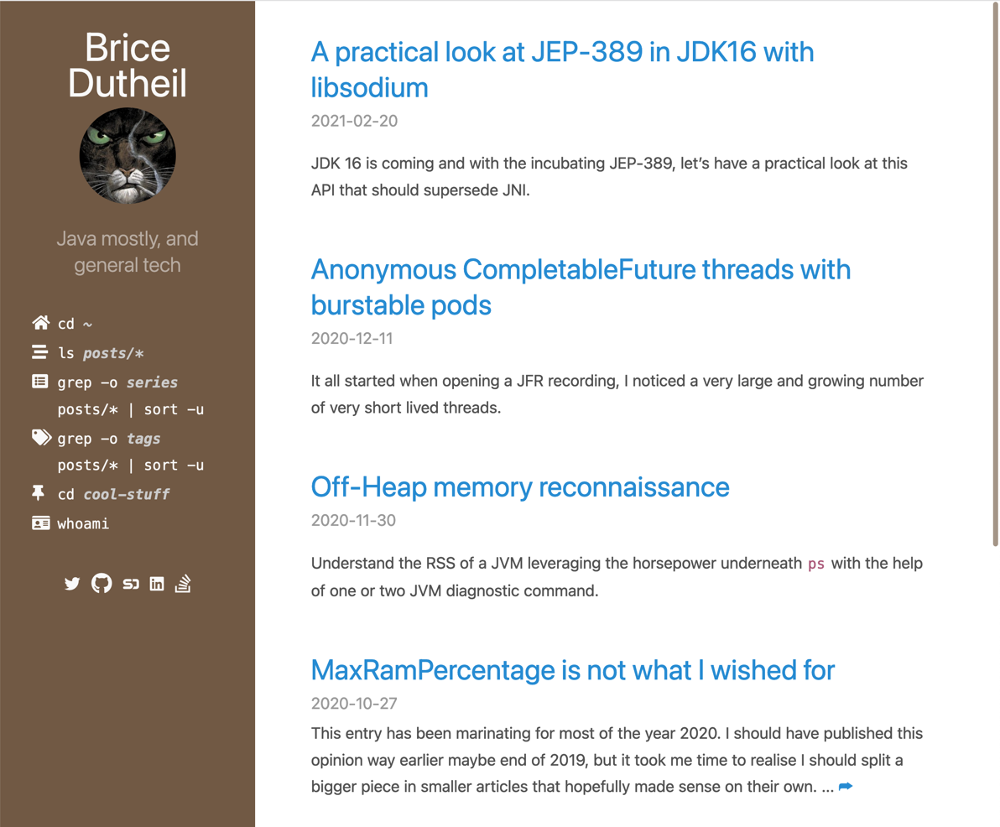

# hyde-hyde

__`Hyde-hyde`__ is a [Hugo](https://gohugo.io)'s theme inspired and derived from @spf13's [Hyde](https://github.com/spf13/hyde.git) and its variant [Nate Finch's blog](https://npf.io). 

## Breaking Changes

Since version 2.0, __`hyde-hyde`__ has been overhauled and, therefore, might cause some disruptions.

* The main styles are refactored and redeveloped using SCSS (see [_static-src/scss_](https://github.com/htr3n/hyde-hyde/tree/v2.0.0/static-src/scss)),  `poole.css` and `hyde.css` are no longer needed because `hyde-hyde.scss` already incorporates relevant elements (I still keep them there for compatibility)
* The layouts have been heavily restructured and modularised further (see [_layouts_](https://github.com/htr3n/hyde-hyde/tree/v2.0.0/layouts))
* Adding '[_Portfolio_](https://github.com/htr3n/hyde-hyde/tree/v2.0.0/layouts/portfolio)' page inspired by Xiaoying Riley (@3rdwave_themes) [Developer-Theme](https://github.com/xriley/developer-theme)
* Switching to use system fonts instead of Web fonts (e.g. privacy issues)

For more details, please refer to [CHANGELOG](CHANGELOG.md). 

A real site in action can be found [here](https://htr3n.github.io) and its [WIP source](https://github.com/htr3n/htr3n-blog) for reference.

## Some Screenshots

### Main page



### Post


### Portfolio


## Installation

__`Hyde-hyde`__ can be easily installed as many other Hugo themes:

```sh
$ cd HUGO_PROJECT

# then either clone hyde-hyde
$ git clone https://github.com/htr3n/hyde-hyde.git themes/hyde-hyde

# or just add hyde-hyde as a submodule
$ git submodule add https://github.com/htr3n/hyde-hyde.git themes/hyde-hyde
```

After that, choose `hyde-hyde` as the main theme.

* `config.toml` 

```toml
theme = "hyde-hyde"
```

* `config.yaml`

```yaml
theme : "hyde-hyde"
```

That's all. You can render your site using `hugo` and see the template in action.

## Options

* __`Hyde-hyde`__ essentially inherits most of Hyde's [options](https://github.com/spf13/hyde#options).

## Customisations

* Most of the customisable SCSS styles in [_static-src/scss/hyde-hyde_](https://github.com/htr3n/hyde-hyde/tree/v2.0.0/static-src/scss/hyde-hyde) and layouts in [_hyde-hyde/layouts_](https://github.com/htr3n/hyde-hyde/tree/v2.0.0/layouts) are modularised and can be altered/adapted easily.

## Author(s)

### Original Developed by Mark Otto

- <https://github.com/mdo>
- <https://twitter.com/mdo>

### Hugo's Hyde Ported by Steve Francia
- <https://github.com/spf13>
- <https://twitter.com/spf13>

## License

Open sourced under the [MIT license](LICENSE.md).
